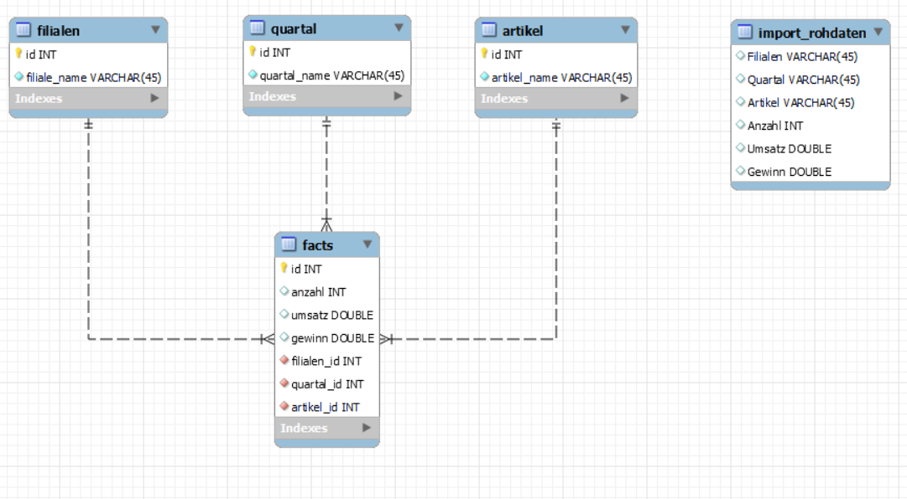

# Lösungsdatei

## Aufgabe Data Warehousing

Es soll ein Data Warehousing für folgende Auswertungen erstellt werden. Als Client wird eine
Pivot Tabelle in EXCEL verwendet. In einer externen Datenbank werden die Rohdaten gespeichert.

## Aufgabe 1:


Wir haben uns für ein ERD (Entity-Relationship Model) entschieden, das aus fünf Tabellen besteht. Die ersten vier Tabellen "Filialen", "Quartal", "Artikel" und "Facts" haben eine starke Beziehung miteinander und bilden das Kernstück des ERD. Diese Tabellen enthalten wichtige Informationen über die Filialen, die Verkaufsquartale, die Artikel und die Verkaufszahlen.

Die fünfte Tabelle, die als "import-rohdaten" bezeichnet wird, hat keine direkte Verbindung zu den anderen vier Tabellen. Sie wird lediglich genutzt, um Daten aus externen Quellen zu importieren und dann in die anderen Tabellen zu integrieren.

Durch die starke Beziehung zwischen den ersten vier Tabellen ist es möglich, eine Pivot Tabelle zu generieren. Das ERD ermöglicht es uns, die Daten in einer organisierten und übersichtlichen Weise zu verwalten.

## Aufgabe 2

Wir mussten das CSV-Datei vor dem Import in die SQL-Tabelle "import_rohdaten" anpassen. Dies beinhaltete das Entfernen von Abständen, das Löschen des Dollar-Zeichens und das Entfernen der Hochkommas. Diese Anpassungen waren notwendig, um eine erfolgreiche Übertragung der Daten in die SQL-Tabelle zu garantieren. Nach diesen Änderungen konnten wir das bearbeitete CSV-Datei problemlos mit SQL-Befehlen importieren.

### SQL

Dieser folgende MySQL-Befehl erstellt eine Datenbank mit dem Namen "data_warehousing" und legt darin fünf Tabellen an: "facts", "filialen", "quartal", "artikel" und "import_rohdaten" nach unseren Vorgaben des ERD's.

In jeder Tabelle werden Spalten definiert, z.B. enthält die Tabelle "facts" die Spalten "id", "anzahl", "umsatz", "gewinn", "filialen_id", "quartal_id" und "artikel_id". Außerdem werden Primärschlüssel, Fremdschlüssel-Beziehungen und Indizes festgelegt.

Zu Beginn des Skripts werden drei Variablen definiert, die den aktuellen Wert von MySQL-Systemvariablen speichern, um sie später wiederherstellen zu können. Dann werden die Systemvariablen "UNIQUE_CHECKS" und "FOREIGN_KEY_CHECKS" auf 0 gesetzt, was bedeutet, dass Überprüfungen auf eindeutige Schlüssel und Fremdschlüssel deaktiviert sind. Außerdem wird die Systemvariable "SQL_MODE" auf eine spezifische Zeichenfolge gesetzt.

Zum Schluss wird die CSV-Datei "/opt/lampp/var/mysql/datawarehouse/RohdatenDataWareHouse.csv" in die Tabelle "import_rohdaten" geladen. Hierbei werden bestimmte Zeichen-Encodings und -Trennzeichen definiert.

```
SET @OLD_UNIQUE_CHECKS=@@UNIQUE_CHECKS, UNIQUE_CHECKS=0;
SET @OLD_FOREIGN_KEY_CHECKS=@@FOREIGN_KEY_CHECKS, FOREIGN_KEY_CHECKS=0;
SET @OLD_SQL_MODE=@@SQL_MODE, SQL_MODE='ONLY_FULL_GROUP_BY,STRICT_TRANS_TABLES,NO_ZERO_IN_DATE,NO_ZERO_DATE,ERROR_FOR_DIVISION_BY_ZERO,NO_ENGINE_SUBSTITUTION';


CREATE SCHEMA IF NOT EXISTS `data_warehousing` DEFAULT CHARACTER SET utf16 ;
USE `data_warehousing` ;

DROP TABLE IF EXISTS `data_warehousing`.`facts` ;

CREATE TABLE IF NOT EXISTS `data_warehousing`.`facts` (
  `id` INT NOT NULL AUTO_INCREMENT,
  `anzahl` INT NULL,
  `umsatz` DOUBLE NULL,
  `gewinn` DOUBLE NULL,
  `filialen_id` INT NOT NULL,
  `quartal_id` INT NOT NULL,
  `artikel_id` INT NOT NULL,
  PRIMARY KEY (`id`),
  INDEX `fk_facts_filialen_idx` (`filialen_id` ASC),
  INDEX `fk_facts_quartal1_idx` (`quartal_id` ASC),
  INDEX `fk_facts_artikel1_idx` (`artikel_id` ASC),
  CONSTRAINT `fk_facts_filialen`
    FOREIGN KEY (`filialen_id`)
    REFERENCES `data_warehousing`.`filialen` (`id`)
    ON DELETE NO ACTION
    ON UPDATE NO ACTION,
  CONSTRAINT `fk_facts_quartal1`
    FOREIGN KEY (`quartal_id`)
    REFERENCES `data_warehousing`.`quartal` (`id`)
    ON DELETE NO ACTION
    ON UPDATE NO ACTION,
  CONSTRAINT `fk_facts_artikel1`
    FOREIGN KEY (`artikel_id`)
    REFERENCES `data_warehousing`.`artikel` (`id`)
    ON DELETE NO ACTION
    ON UPDATE NO ACTION)
ENGINE = InnoDB;

DROP TABLE IF EXISTS `data_warehousing`.`filialen` ;

CREATE TABLE IF NOT EXISTS `data_warehousing`.`filialen` (
  `id` INT NOT NULL AUTO_INCREMENT,
  `filiale_name` VARCHAR(45) NOT NULL,
  PRIMARY KEY (`id`),
  UNIQUE INDEX `name_UNIQUE` (`filiale_name` ASC))
ENGINE = InnoDB;

DROP TABLE IF EXISTS `data_warehousing`.`quartal` ;

CREATE TABLE IF NOT EXISTS `data_warehousing`.`quartal` (
  `id` INT NOT NULL AUTO_INCREMENT,
  `quartal_name` VARCHAR(45) NOT NULL,
  PRIMARY KEY (`id`),
  UNIQUE INDEX `quartal_UNIQUE` (`quartal_name` ASC))
ENGINE = InnoDB;

DROP TABLE IF EXISTS `data_warehousing`.`artikel` ;

CREATE TABLE IF NOT EXISTS `data_warehousing`.`artikel` (
  `id` INT NOT NULL AUTO_INCREMENT,
  `artikel_name` VARCHAR(45) NOT NULL,
  PRIMARY KEY (`id`),
  UNIQUE INDEX `artikelname_UNIQUE` (`artikel_name` ASC))
ENGINE = InnoDB;


DROP TABLE IF EXISTS `data_warehousing`.`import_rohdaten` ;

CREATE TABLE IF NOT EXISTS `data_warehousing`.`import_rohdaten` (
  `Filialen` VARCHAR(45) NULL,
  `Quartal` VARCHAR(45) NULL,
  `Artikel` VARCHAR(45) NULL,
  `Anzahl` INT NULL,
  `Umsatz` DOUBLE NULL,
  `Gewinn` DOUBLE NULL)
ENGINE = InnoDB;
LOAD DATA INFILE '/opt/lampp/var/mysql/datawarehouse/RohdatenDataWareHouse.csv'

INTO TABLE data_warehousing.import_rohdaten
CHARACTER SET utf8
FIELDS TERMINATED BY ';'
LINES TERMINATED BY '\n'
IGNORE 1 ROWS;

INSERT IGNORE INTO filialen (filiale_name)
select Distinct Filialen from import_rohdaten;

INSERT IGNORE INTO quartal (quartal_name)
SELECT DISTINCT Quartal FROM import_rohdaten;

INSERT IGNORE INTO artikel (artikel_name)
SELECT DISTINCT Artikel FROM import_rohdaten;

INSERT INTO facts (anzahl, umsatz, gewinn, filialen_id, quartal_id, artikel_id)

SELECT Anzahl, Umsatz, Gewinn,
(SELECT filialen.id FROM filialen WHERE filialen.filiale_name = import_rohdaten.Filialen),
(SELECT quartal.id FROM quartal WHERE quartal.quartal_name = import_rohdaten.Quartal),
(Select artikel.id FROM artikel WHERE artikel.artikel_name = import_rohdaten.Artikel)
FROM import_rohdaten;

DROP VIEW IF EXISTS vw_data_warehousing;
CREATE VIEW vw_data_warehousing AS
SELECT
facts.anzahl AS Anzahl,
facts.umsatz AS Umsatz,
facts.gewinn AS Gewinn,
filialen.filiale_name AS Filiale,
artikel.artikel_name AS Artikel,
quartal.quartal_name AS Quartal

FROM facts
JOIN filialen ON filialen.id = facts.filialen_id
JOIN artikel ON artikel.id = facts.artikel_id
JOIN quartal ON quartal.id = facts.quartal_id
```
